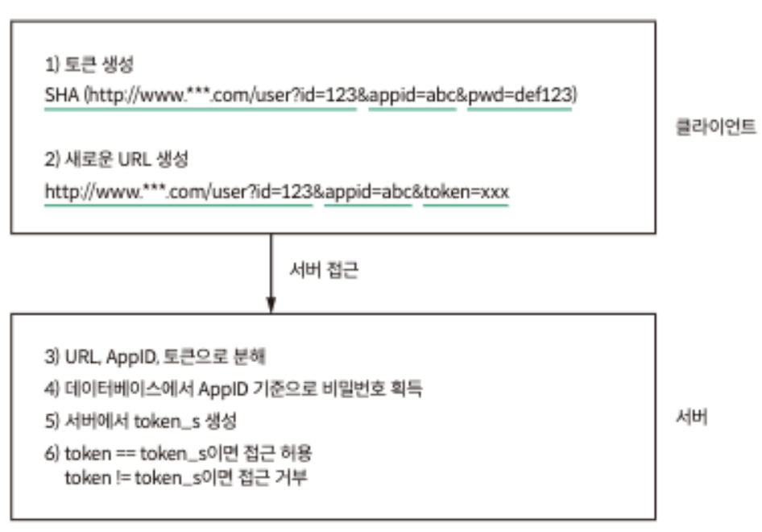
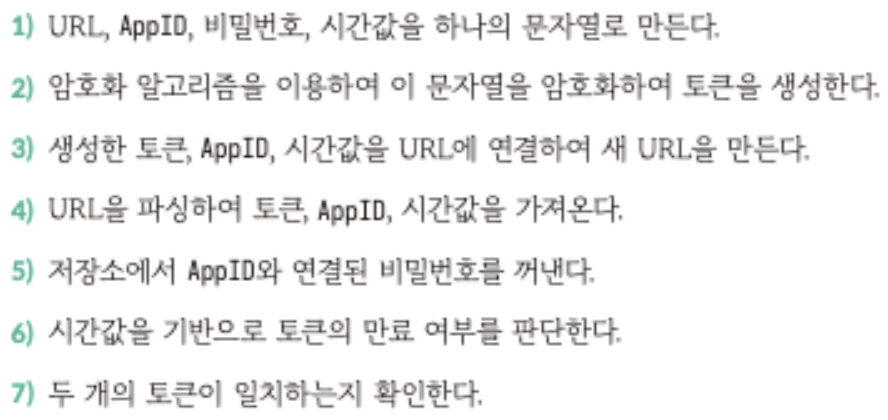
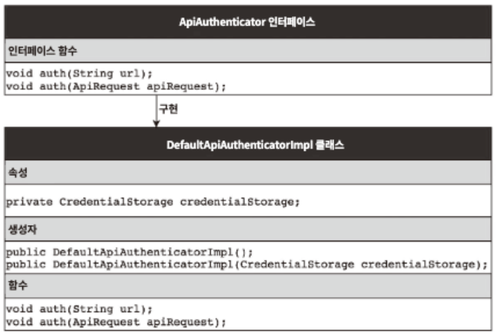

## Summary

- 객체지향 분석 및 설계는 어떻게 하는지?
    - 예시) 마이크로 서비스에서 인증 기능

### **객체지향 분석하기**

**기본 분석**

- AppID, 비밀번호 담아서 HTTP 요청
- 마이크로 서비스 저장소에서 저장된 AppID와 비밀번호 비교
- 일치하면 호출 허용 O, 일치하지 않으면 호출 허용 X

**1차 분석**

- 근데 AppID와 비밀번호는 인증되지 않는 시스템이나 해커 등 가로챌 위험이 있음
- OAuth 인증을 이용하여 URL을 AppID와 비밀번호 추가하고 암호화하여 토큰을 생성하는 방식으로 진행

  </img>

**2차 분석**

- URL에 의해 생성되는 토큰은 매번 고정된 값이어서 중간에 해커가 가로채면 보안에 문제가 생길 우려가 있음
- 그래서 토큰에 현재 시간 값을 담아서 보내면 서버에서 유효 시간인지 확인이 가능 함
    - 유효 시간을 초과하면 토큰 만료

**3차 분석**

- 해커가 토큰 유효 시간이 만료되기 전까지 요청을 보낼 수 있어서 여전히 보안 문제가 있음
- 여전히 허점이 있지만 보안, 개발 비용, 시스템 성능에 미치는 영향을 고려했을 때 합리적인 절충안 !
- 마지막 마이크로 서비스 저장소에 AppID와 비밀번호 어디에 저장?
    - DB ? 비즈니스와 연관성이 낮은 기능 개발할 때는 X
    - 로컬 파일, Redis, 클라우드 저장소 등등

### 객체지향 설계방법

1. **책임과 기능을 나누고 어떤 클래스가 있는지 확인**
- 요구사항들을 “**단일 책임**” 기능으로 분리

  </img>

- 1,2,6,7번은 AuthToken 클래스
- 3,4번은 ApiRequest 클래스
- 5번은 CredentialStorage 클래스

1. **클래스의 속성과 메서드를 정의**
- AuthToken 클래스
    - create(), getToken(), isExpired(), match()
- ApiRequest 클래스
    - createFromFullUrl(), getToken(), getAppId(), getTimestamp()
- CredentialStorage 클래스
    - getPasswordByAppId()

1. **클래스 간의 상호 작용을 정의**
- 저장소에서 AppID 연결된 비밀번호를 가져오는 방법은 다양함
    - Mysql, 로컬 파일, Redis 등등
- CredentialStorage 인터페이스 정의하여 다형성과 캡슐화
    - MysqlCredentialStorage 클래스
    - RedisCredentialStorage 클래스

1. **클래스 연결 및 실행할 수 있는 클래스 제공**
- 마지막으로 모든 클래스를 함께 조합하고 실행할 수 있는 클래스를 제공

  </img>

- 인증은 독립적으로 실행되는 시스템이 아니라 시스템에서 통합 실행되는 구성 요소이기 떄문에
모든 구현 세부 사항을 캡슐화 진행
    - ApiAuthenticator 인터페이스
        - DefaultApiAuthenticator 클래스

## Advantages

- 단순 비즈니스 CRUD 개발이 아닌, 복잡한 기능이나 새로운 기능을 개발할 때 사용을 할 수 있다.
- 요구 사항을 세분화해서 진행하기 때문에 분석과 설계가 끝나면 코드 짜기가 쉽다.

## Disadvantages

- 경험이 없으면 분석과 설계에 대한 많은 시간이 소요 된다.
- 요구사항을 정확히 파악하기 위해서 기획지와 많은 커뮤니케이션이 필요하다.

## Wrap-up

- 대학생 시절, 맨 처음 신입 시절, 지금도 어떠한 기능을 수행하기 전에 간단하게 설계를 진행하고 코드를 짠다.
- 객체지향 분석, 설계, 프로그래밍을 통해서 어떤 것을 먼저 하고 이어서 무엇을 할 것인지가 매우 명확할 뿐만 아니라 따라야 할 규칙이 있다.
- 이로 인해, 설계 경험이 많지 않는 주니어 엔지니어에게 단계적으로 할 수 있는 방법이므로 참고하면 좋을 거 같다.
