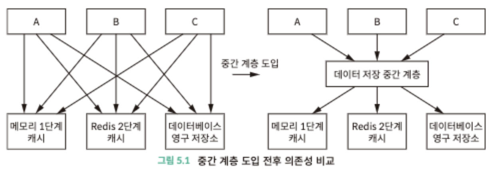
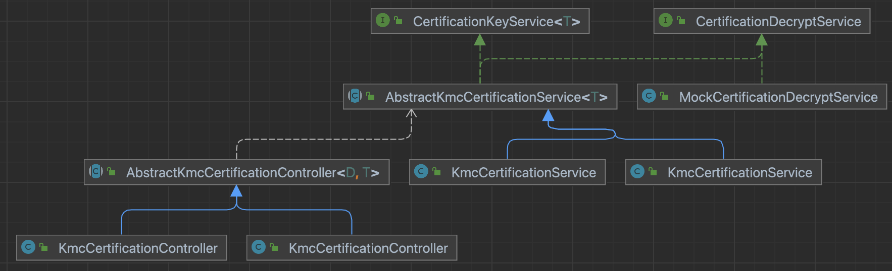

## Summary

- 리팩터링의 주요 목적인 디커플링이 어떤건지, 어떤 식으로 하는지 알아보기

## Concept

- 디커플링이란?
    - 소프트웨어의 구성 요소 간의 의존성을 최소화하는 설계 원칙을 의미
    - 모듈 A, B, C 있을 때 A 구성 요소가 변경되고 바뀌어도 다른 구성 요소에 영향에 미치지 않도록 함
    - 즉, 높은 응집도와 낮은 결합도를 가진 코드가 다른 코드의 영향이 낮음
- 디커플링 방법
    1. 캡슐화와 추상화 사용하기
    2. 중간 계층으로 디커플링
        <div style="text-align:center;">
          </img>
        </div>
    3. 모듈화와 계층화로 디커플링

<br/>

## Example Case

- KMC 휴대폰 인증 서비스
- 개발환경 별로 서비스 구축
    - DEV
    - PRD


### 디커플링 전

- `KmcController`
- `KmcService`
    - getUrlCode()
    - ..등등

```java
// 환경별로 URL code 가져오기
private String getUrlCode(KmcDto dto) {
   if (ProfileLevel.DEV.name().equals(dto.getProfile())) {
       return DEV;
    }
        
   if (ProfileLevel.PRD.name().equals(dto.getProfile())) {
       return PRD;
   }
}
```

1. 단일 메서드에서 여러 가지 역할을 수행하므로  **코드의 응집도가 낮아짐**
2. 각 개발환경에 대한 처리가 많아질수록 코드의 가독성과 유지보수성이 떨어짐
3. 새로운 개발환경이 추가될 때마다 메서드를 수정하므로 유연성이 떨어지고 확장성이 낮아짐

<br />

### 디커플링 후

- 개발 환경 별로 클래스 분리
- `KmcController` `KmcService` 디커플링 진행
    - 구현 세부 사항 캡슐화 → 인터페이스
    - 중복 코드 → 추상화

**Diagram**

<div style="text-align:center;">
    </img>
</div>


- 각 클래스가 단일 책임 원칙에 따라 각각의 개발환경에 대한 처리를 담당
- 클래스의 응집도가 높아지고 코드의 가독성과 유지보수성이 향상
- 새로운 개발환경을 추가할 때에도 해당 클래스만 수정하면 되므로 확장성 향상
