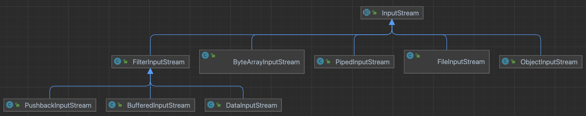

## Summary

- 레코레이터 패턴 파헤쳐보기

 

## Concept

**데코레이터 패턴이란?**

- 데코레이터 패턴의 기본 개념은 "기능을 추가하고 싶은 객체를 감싸는 또 다른 객체를 만들어서 기능을 추가한다"는 것입니다.
- 이 추가된 객체를 데코레이터(Decorator)라고 부릅니다.

 

## Example

### **`Java IO` 라이브러리**

- 자바 라이브러리 중에서 데코레이터 패턴을 사용하여 대표적인 예로는 `java.io` 패키지의 입출력 스트림 클래스들이 있습니다
- 파일이나 네트워크 소켓과 같은 다양한 데이터의 읽기와 쓰기를 담당하는 수십 개의 클래스로 구성되어 있는 크고 복잡한 라이브러리이다.

 

### **Diagram** - Java IO `Inputstream` 클래스

    </img>

- `FilterInputStream` 클래스를 보면 여러 개의 데코레이터 클래스가 보인다.
- 클래스의 역할을 보면
    - `FilterInputStream` : 데코레이터 클래스들의 중복적인 코드 모음집
    - `BufferedInputStream` : 버퍼링된 입력 스트림을 제공. 입력된 데이터를 버퍼에 저장해두었다가 읽는 동작을 수행
    - `DataInputStream` : 정수, 실수, 문자열 등의 다양한 자료형 읽는 데 사용
    - `PushbackInputStream` : 입력된 데이터를 되감기(push back)할 수 있는 기능을 제공

 

## 만약 데코레이터 패턴을 쓰지 않고 그냥 구현하면 어떻게 될까?

- 그냥 구현한다는 의미는 상속 기반으로 구현
- 사실상 데코레이터 클래스들은 상속으로 구현해도 아주 큰 문제 없음
- 하지만 문제점만 많아진다.

### **클래스 폭발**

- 다양한 기능 조합에 대해 별도의 클래스를 만들어야 함.
- 예를 들어 `Buffered`, `Compressed`, `Encrypted` 기능을 조합하려면 다음과 같은 클래스 필요
    - `BufferedInputStream`
    - `CompressedInputStream`
    - `EncryptedInputStream`
    - `BufferedCompressedInputStream`
    - `BufferedEncryptedInputStream`
    - `CompressedEncryptedInputStream`
    - `BufferedCompressedEncryptedInputStream`
    - 이처럼 조합 가능한 모든 기능에 대해 클래스를 만들어야 하므로 클래스 수가 기하급수적으로 증가

### 코드 중복

- `FilterInputStream` 클래스에서 데코레이터 클래스들의 중복되는 코드들을 담고 있는데 상속 기반으로 하게 되면 코드 중복 발생

### **유연성 부족**

- 상속 기반 구조는 정적이며, 런타임에 동적으로 기능을 조합하거나 변경할 수 없습니다. 기능을 변경하려면 객체를 새로 생성해야 함

### 단일 책임 원칙 위반

- 만약에 위의 `BufferedDataOutputStream` 클래스를 추가하게 되면 버퍼링과 다양한 데이터 타입 쓰기를 모두 담당
- 두 가지 역할을 하게 되므로 SRP 위반

### 재사용성 감소

- 각 기능이 하나의 클래스로 합쳐지면, 특정 기능만 필요로 하는 경우에도 불필요한 기능이 함께 포함
- 이는 코드의 재사용성을 감소
