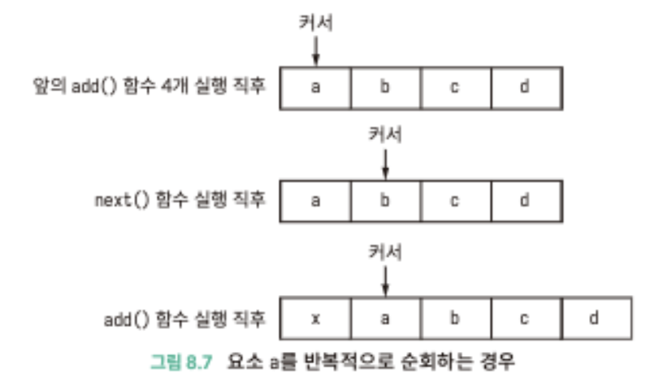

## Summary
반복자 패턴이 무엇인가?

<br />

## Concept
반복자 패턴이란?
  - 컬렉션 기반(리스트, 배열, 해시맵) 내부 구조를 노출하지 않고도 순차적으로 요소를 접근할 수 있는 패턴
  - 자바에서는 개발자가 직접 구현하지 않고 기본으로 제공해주는 java.util 라이브러리에서 사용 가능


<br />

반복자 패턴 구성 요소
- Iterator 인터페이스: 컬렉션의 요소들을 순차적으로 접근하기 위한 인터페이스 클래스. hasNext()와 next() 메서드 정의
- Concrete Iterator 구현: Iterator 인터페이스를 구현하여 실제 컬렉션의 요소들을 순회하는 역할
- Collection 인터페이스: 컬렉션을 나타내며, Iterator 객체를 반환하는 메서드를 정의
- Collection Aggregate 구현: Aggregate 인터페이스를 구현하여 구체적인 Iterator 객체를 반환하는 역할

<br />

## Example
```
ArrayList<Integer> list = new ArrayList<>();
list.add(1);
list.add(2);
list.add(3);

// Iterator 생성
Iterator<Integer> iterator = list.iterator();

// 반복자를 사용한 요소 순회
while (iterator.hasNext()) {
Integer element = iterator.next();
System.out.println(element);
}
```
- ArrayList -> Collection 클래스
- Iterator -> Iterator 클래스
  - hasNext(): 컬렉션에 순회할 다음 요소가 있는지 여부를 반환
  - next(): 컬렉션의 다음 요소를 반환하고, 순회 포인터를 다음 요소로 이동
  - remove(): 컬렉션에서 현재 요소를 제거
- Collection 클래스를 생성하고 반복자 패턴인 iterator 생성해서 요소 순회하는 코드

<br />

### 내부 코드 분석

````
public class ArrayList<E> extends AbstractList<E> implements List<E> ...{
    public void add(int index, E element) {
        rangeCheckForAdd(index);
        modCount++;
        final int s;
        Object[] elementData;
        if ((s = size) == (elementData = this.elementData).length)
        elementData = grow();
        System.arraycopy(elementData, index,
        elementData, index + 1,
        s - index);
        elementData[index] = element;
        size = s + 1;
    }

    // 내부 클래스
    private class ListItr extends Itr implements ListIterator<E> {
        ListItr(int index) {
            super();
            cursor = index;
        }
        
        public void add(E e) {
            checkForComodification();

            try {
                int i = cursor;
                ArrayList.this.add(i, e);
                cursor = i + 1;
                lastRet = -1;
                expectedModCount = modCount;
            } catch (IndexOutOfBoundsException ex) {
                throw new ConcurrentModificationException();
            }
        }
    }
    
    // 정확한 요소인지 검증
    final void checkForComodification() {
        if (modCount != expectedModCount)
            throw new ConcurrentModificationException();
    }
}
````

- 순회하는 코드는 내부 클래스로 정의되어 있음
- arrayList.add 보면 modCount++ 하고 있고 ListItr.add 를 보면 checkForComodification() 하고 있음
- 그 이유는 요소 순회를 할 때 요소를 추가하거나 삭제할 때 예기치 않는 결과가 나올 수 있음
- 예시 사진
<div style="text-align:center;">
          </img>
        </div>


<br />
<br />
<br />

### 만약 반복자 패턴을 사용하지 않고 그냥 구현하게 된다면?
````
ArrayList<Integer> list = new ArrayList<>();
list.add(1);
list.add(2);
list.add(3);

// 인덱스를 이용한 요소 순회
for (int i = 0; i < list.size(); i++) {
  Integer element = list.get(i);
  System.out.println(element);
}
````
- 일반적으로 for 문을 사용해서 list.get(i) 요소를 순회
- 다른 타입의 컬렉션(LinkedList, HashSet) 사용하게 되면 순회 방식이 달라지는데, 이런 경우 인덱스로 접근할 수 없어서 방법 사용 X
- 컬렉션 클래스와 순회 로직은 서로 밀접하게 결합되어 있어서 단일 책임 원칙 위반
- 코드 중복, 내부 구조 노출
