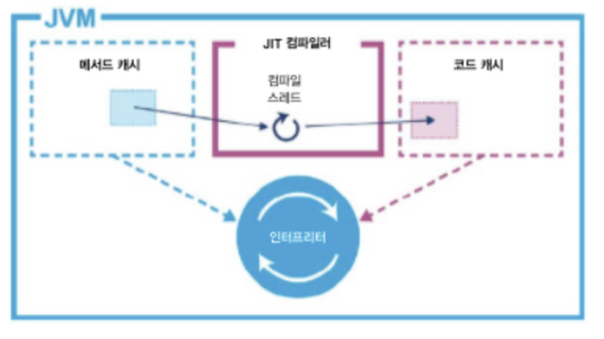
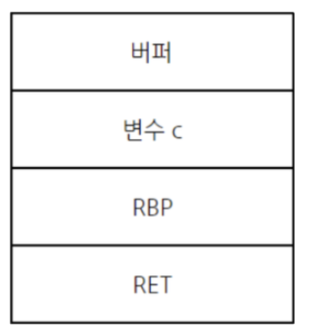

### Summary

자바는 다양한 플랫폼에서도 한번의 컴파일만 됩니다.

https://junhyunny.github.io/information/java/jvm-execution-engine/

https://jiwondev.tistory.com/150

[너무 좋은 글]https://velog.io/@ddangle/Java-JIT-컴파일러-sfbp9dtu 

## Concept

<aside>
💡 알고갈 개념
일반적인 컴파일러의 컴파일 방식

1. 전단부
    1. 어휘분석 : 언어마다 지정된 토큰 생성
    2. 구문분석 : 적절한 토큰끼리 엮이는지 확인하며 구문 트리 생성(추상 구문트리)
    3. 의미분석 : 사용되는 데이터들의 타입 체크
    4. 중간코드 생성 : 어셈블리언어로 변환될 중간 코드 생성
2. 후단부
    1. 목적코드 생성 : 목적 기계에 대한 기계어로 변형
    2. 코드 최적화 : 이건 중간 코드 생성 단계에서도 이루어질 수 있다.
</aside>

### 자바의 컴파일 방식

일반적인 컴파일러의 구조와 비슷하지만 자바는 전단부와 후단부가 확실하게 나눠져있다.

javac는 전단부로 Java ByteCode(중간코드)를 만들어내고 후단부에서 인터프리터와 JIT컴파일러가 최적화를 통해 기계어를 만든다.

JVM은 CPU를 추상화한 구조라서, 다른 플랫폼에 의존적이지 않고 실행이 가능하다. 

JVM 내부적으로 바이트코드를 읽는 일을 하는 프로그램은 Interpreter이다. interpreter는 JVM내부 Method 영역(현재는 JVM이 아니라 외부로 옮겨졌다.)에 바이트코드를 계속해서 읽어드린다. 읽어드린 바이트코드를 한 줄씩 실행시키면서 프로그램 단위(메서드와 루프)로 프로파일을 기록한다. 프로파일을 기준으로 많이 사용되는 단위를 측정하고 이를 JIT 컴파일러에게 컴파일 대상으로 위임한다. 

자바에서 바이트 코드의 프로파일을 조회하는 방법

javap -v -l -s 바이트 코드.class

### JIT 컴파일러

Interpreter는 한줄 씩 읽기 때문에 속도측면에서 느리다. 이를 해결하기 위해 Just In Time 컴파일러로 최적화를 진행한다.

Interpreter로 바이트 코드를 읽으면서 자주 사용되는 바이트 코드 영역을 런타임 중에 JIT 컴파일러에게 위임하여 기계어로 컴파일하여 사용한다.

### JVM이 컴파일 타임을 런타임으로 잡은 이유는 뭘까?

기존에 C/C++의 경우 정적 컴파일을 사용한다. 이를 AOT(Ahead-of-Time)이라고 한다. 

기본적으로 정적 컴파일이 동적 컴파일보다 실행이 빠르다. 이유는 정적 컴파일은 이미 기계어 컴파일이 완료된 상태이기 때문에 실행 시 동작이 없기 때문에 빠르다.

그럼 JVM은 왜 정적 컴파일을 하지 않고 동적으로 컴파일을 하는걸까? 

답은 코드 최적화에 있다.

정적 컴파일은 컴파일의 기회가 단 한번 뿐이다. 반면에 인터프리터 방식을 사용하는 JVM의 경우 해당 프로그램 단위의 프로파일을 가지고 현재 상황에 대한 최적의 컴파일 대상을 정할 수 있게된다.

### 그럼 JIT 컴파일러는 어떤 기준으로 컴파일할까?

컴파일 임계치(complie threshold) : 인터프리터가 코드를 읽으면서 해당 코드를 컴파일할 기준을 의미한다.

> complie threshold = method-entry-counter + back-edge-loop-counter;
> 

컴파일 임계치는 **JVM내에 있는 메서드가 호출된 횟수** 더하기 **메소드가 루프를 빠져나오기 전까지 횟수** 이다.

여기서 Back-edge loop counter를 가진 프로그램 단위가 컴파일 우선순위가 높아진다.

여기서 컴파일 우선순위가 있을 수 있는 이유가 있다. 컴파일 임계치에 달성하면 바로 컴파일하는게 아니라 컴파일 대상이되는 바이트 코드를 우선순위 Queue에 넣고 JIT Complier가 하나씩 뽑아서 컴파일하기 때문에 우선순위가 있을 수 있다.

그럼 컴파일이 완료되면 컴파일된 코드는 어떻게될까?

### OSR(on stack replacement)

https://die4taoam.tistory.com/52

- 필요에 의해 stack을 조작하는 방법

일반적으로 Stack에서 함수가 함수를 호출하게되면 돌아갈 위치를 호출되는 함수의 stack Frame에 두게되는데 이것을 Ret이라고 표현한다. 대표적으로 이 Ret을 조작할 때 사용한다.

만약에 코드가 최적화되거나 기계어로 번역된 코드가 있다고 하면 OSR을 통해서 호출할 함수의 위치를 최적화 기계어 코드로 변경해서 호출 할 수 있다.
  

----
## :책내용

**Summary**

- 약간의 링커를 곁들인 좀 더 자세한 컴파일러의 구조
- 결국 컴파일러는 기계어 실행파일을 만드는 프로그램

**Concept**

- 컴파일러는 고수준 언어를 저수준 언어로 변환해주는 프로그램
    - 이게 가장 주 목적이고 이 목적을 위해 더 최적화를 한다던가 구문 트리를 더 효율적으로 만든다던가 한다.
- 소스 파일이라는 먹이를 주면 실행 파일의 형태로 뱉어 준다.
    - 링커도 같은 역할을 하는데 그럼 컴파일러는 각 소스파일을 실행파일 형태로 만들어주고 링커는 이 실행파일들을 하나의 실행파일 형태로 만들어 준다고 생각하면될까? → 예를 들어 java의 jar 파일
- 컴파일러는 크게 전단부 후단부로 나뉜다.
    - 전단부 : 소스 프로그래밍 언어와 관계되는 부분으로 소스 파일을 분석하고 중간 코드를 생성하는 부분.
        - 각 언어마다 필요 → 이걸로 봐선 언어별로 어셈블리어 변환에 대한 책임이 있는 것 같다.
        - 구조
            - 어휘 분석기(**lexical analysis**) : 소스 파일에서 정해진 토큰 생성
                - 토큰 :  언어 설계자가 지정한 문법적 의미의 최소단위, 특수형태와 일반형태로 나뉨
                - 각 토큰은 언어에 따라 토큰 고유 번호를 가진다. 이는 효율적 처리를 위함임(== sequence_no)
                - 어휘 분석기는 토큰을 추출하고 해당 소스파일 내부에서 토큰에 할당된 추가 정보들을 가지고 있는다.
            - 구문 분석기(**syntax analyzer, parser**) : 해석기, 이를 통해 각 언어의 문법적 오류 체크
                - 두가지 행동 진행 → 문법 오류 체크, 의미 분석 체크
                - 특정 토큰 다음에 와야하는 토큰들의 규칙을 알고 있고 이 규칙에 따라 **구문 트리**를 만든다. 이를 어길시 **문법오류**(syntex error)가 발생(이건 토큰 규칙만 체크)
            - 의미 분석(**semantic** **analyzer**)을 말한다. 여기서 의미 분석이란 내가 생각하기에는 타입에 대한 이야기 같다. 각 토큰에 할당된 값들에 대한 규칙. 가령, 비교 토큰이 있을 때 비교되는 값들의 형식이 다르면 안되는 것들을 말하는 것 같다.
                - ⚠️ 의미 분석은 컴파일러를 만든 사람에 따라 독립적으로 가져갈 수도 있고 구문 분석단계에서 실행될 수도 있고 중간코드 생성과정에서 실행될 수도 있다.
                - 형 변환(type conversion), 의미 분석 단계에서 처리
                    - ex1) 대부분의 프로그래밍 언어에서는 실수가 배열의 첨자로 사용되었을 때 에러로 간주
                    - ex2) 어떤 언어에서는 실수와 정수의 혼합 연산을 허용하는데 이때는 연산을 수행하기 전에 정수를 실수로 바꾸어 주는 작업이 필요
            - 질문  : 의미 분석과 문법오류 체크는 뭐가 다를까?
            - 중간 코드 생성 : 각 언어의 구문 트리를 가지고 중간 코드를 만드는 단계. 중간코드는 어셈블리어로 변환된다.
    - 후단부 : 소스 언어보다는 목적 기계에 의존적이며 전단부에서 생성한 중간 코드를 특정 기계를 위한 목적 코드로 번역하는 부분
        - 목적 기계당 하나씩 필요 → CPU 기준으로 봤을 때 여러 종류의 CPU가 있는 상황을 말하는 것 같다. 책 부분의 통용, 문접이 만들어지는 기준이 될 것 같다.
        - 전단부 이후의 프로세스, 중간 코드에 대한 목적 프로그램이 생성됨
        - 하는 일
            - 목적 코드 생성 : 중간 코드를 입력으로 받아 그와 의미적으로 동등한 목적 기계에 대한 코드를 생성하는 일을 한다.
                - 적정 레지스터(캐시보다 연산장치에 더 가까운 저장소) 할당
                - 중간코드에 맞는 어셈블리어 생성
            - 코드 최적화
                - 지역 최적화({}블록 내부 행위), 전역 최적화
                - precode optimization(중간 코드에서 최적화), postcode optimization(목적 코드에서 최적화)

**Advantages**

- 컴파일하는 중 에러 발생 위치를 알 수 있을 것 같다.
- 컴파일의 최적화 대상이 되는 코드들을 안다면 코드 작성시 해당 유의하여 작성할 수 있을 것 같다.

**Disadvantages**

- 프로그래밍 언어를 개발할게 아니라면 컴파일러를 잘 안다고 우리가 할 수 있는 부분이 없다.

**Wrap-up**

- 컴파일러의 영역도 두가지 전단부, 후단부로 나뉜다는 것을 알게되었다.
- 컴파일러가 이런식으로 진행된다는 것정도만 알면 될 것 같습니다.
- 각 프로그래밍 언어마다 소스파일을 분석해서 구문트리를 만들고 어휘 분석을 하고 구문 분석을 진행합니다. 그리고 의미를 분석하고 어셈블리로 변경할 중간코드를 만듭니다. 그리고 각 기계에 따라 목적 코드를 생성합니다.
