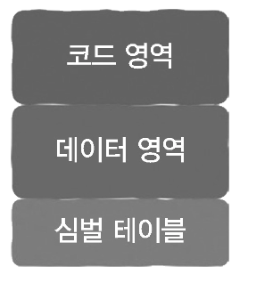
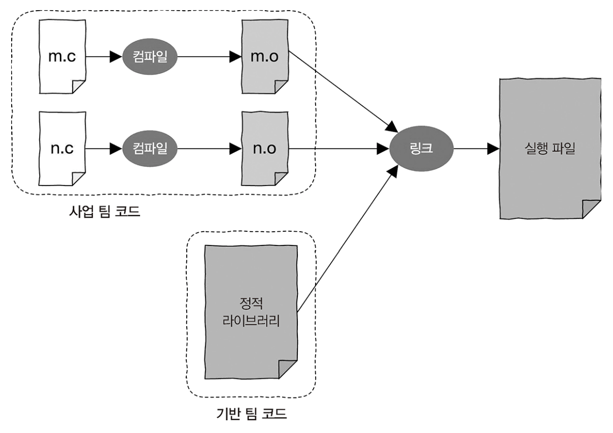
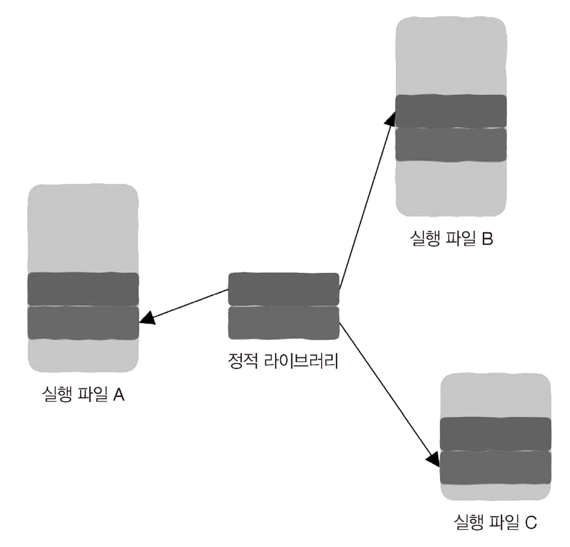
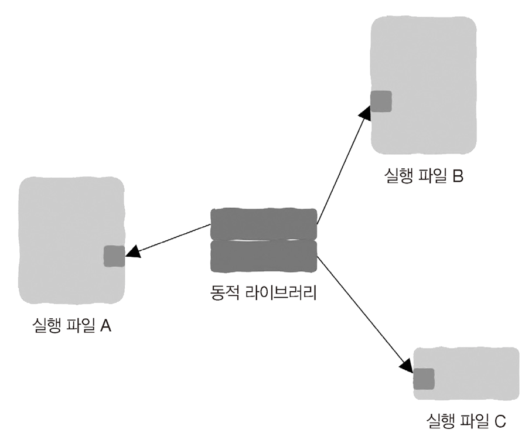

## Summary
**"Hello, World"** 고수준 언어에서 저수준 언어로 내려가보기

<br>

## Concept
### 1. 고수준 프로그래밍 언어 (C/C++)
```java
#include <stdio.h>

int main() {
    printf("Hello, World!\n");
    return 0;
}
```
- 간단한 Hello, World 출력되는 코드


### 2. 컴파일러
- 컴파일러는 고수준 언어로 작성된 소스 코드를 저수준의 기계어로 번역
- 컴파일 과정은 여러 단계로 나뉨
    1. 전처리
    2. 컴파일
        - 전처리 된 소스 코드를 어휘 분석과 구문 분석을 거쳐 중간 표현 변환
        - 중간 표현은 다시 최적화 과정을 거쳐 **어셈블리어 언어 변환**
        - 어셈블리어 언어를 운영체제(Linux) 기준으로 보면
       ```java
            .section	.rodata                // 읽기 전용 데이터 섹션을 정의합니다. 문자열 "Hello, World!"가 여기에 저장
          .LC0:                               // 문자열 리터럴 "Hello, World!"가 저장된 위치
             .string	"Hello, World!"         
             .text
             .globl	main
             .type	main, @function
          main:                               // 함수의 시작
          .LFB0:
             .cfi_startproc
             pushq	%rbp                    // 이전의 베이스 포인터를 스택에 저장
             .cfi_def_cfa_offset 16
             .cfi_offset 6, -16
             movq	%rsp, %rbp                  // 현재 스택 포인터를 베이스 포인터로 설
             .cfi_def_cfa_register 6
             subq	$16, %rsp                   // 스택 공간을 16바이트만큼 확보
             movl	$.LC0, %edi                 // 문자열 리터럴의 주소를 printf 함수의 첫 번째 인자 레지스터 edi에 저
             call	puts@PLT
             movl	$0, %eax                    // 반환 값을 0으로 설정
             leave                            // 스택을 정리하고 베이스 포인터를 복원
             .cfi_def_cfa 7, 8
             ret                              // mian 함수에서 반환
             .cfi_endproc
       ```
    3. 어셈블리
        - 어셈블리어 코드를 **기계어 코드**로 변환하여 오브젝트 파일 생성
        - 기계어는 16진수 형태로 나타내어져 있으며, 각 명령어는 CPU가 직접 해독하고 실행할 수 있는 이진 코드로 구성
        - 기계어 코드 예시
       ```java
          55                      ; pushq %rbp                // 베이스 포인터를 스택에 저장
          48 89 e5                ; movq %rsp, %rbp           // 현재 스택 포인터를 베이스 포인터로 설정
          48 83 ec 10             ; subq $16, %rsp            // 스택 공간을 16바이트만큼 확보
          48 8d 3d 00 00 00 00    ; lea .LC0(%rip), %rdi
          e8 00 00 00 00          ; call puts@PLT
          b8 00 00 00 00          ; movl $0, %eax
          c9                      ; leave
          c3                      ; ret
        ```
    4. 링커
        - 여러 오브젝트 파일과 라이브러리를 결합하여 실행 가능한 **바이너리 파일**을 생성
        - 이 과정에서 심벌 해석, 모든 실행 파일을 결합한 파일 생성, 재배치 이루어짐

<br>

### [ 링커의 과정 ]
1. 심볼 해석
   - 심볼의 뜻은 전역 변수와 함수의 이름을 포함하는 모든 변수 이름을 의미
   - 지역 변수는 모듈 내에서만 사용되어 외부에서 참조할 수 없으므로 링커의 관심 대상 X
   - 이 단계에서는 대상 파일에서 참조하고 있는 각각의 모든 외부 심벌 마다 대상 정의가 반드시 존재하는지, 단 하나만 존재하는지 확인
   - 예시) C++ 코드
   ```java
    int g_a = 1;               //  전역 변수
    extern int g_e;            // 외부 변수
    int func_a(int x, int y):  // 함수 참조
    
    // 함수
    int func_b()
    {
         int m = g_a + 2;
         return func_a(m + g_e);
    }
   ```
   - 지역 변수: 링커가 관심 X
   - 전역 변수
     - 전역 변수 g_a와 func_b 두 개가 다른 모듈에서 참조할 수 있음
     - 또한 다른 모듈에서 정의된 g_e 변수와 func_a 변수 두 개를 참조하고 있음 

<br>

- 링커가 실제로 관심을 갖는 것은 전역 변수와 함수이다.
- 이를 위해 컴파일러는 각 파일에 심볼 테이블을 만들어서 두 가지 내용을 내용을 담아서 정의합니다. 
  - 내가 정의한 심벌(전역 변수, 함수) -> g_a, func_b
  - 내가 사용하는 외부 심벌 -> g_e, func_a
<div style="text-align:center;">
  </img>
</div>


- 실제로 코드를 작성할 때 사용하지 않는 변수를 정의할 수 있지만, 사용하지 않는 함수를 정의하면 오류가 발생할 수 있기 때문에 주의가 필요
   ```java
    void func();
    
    void main()
    {
         // undefined reference to 'func' 오류 발생
         func();
    }
   ```


<br>
<br>

2. 모든 실행 파일을 결합한 파일 생성
   - 모든 파일을 합치기 위해 실행 파일 종류로는 정적 라이브러리, 동적 라이브러리, 실행 파일이 있다.

**정적 라이브러리**
<div class="image-container">
  
  
</div>

- 소스 파일 여러 개를 미리 개별적으로 컴파일하고 링크하여 정적 라이브러리로 생성
- 코드가 의존하는 외부 코드를 매번 컴파일하지 않아도 되기 때문에 컴파일 속도 향상
- 하지만 라이브러리 코드가 실행 파일에 포함되므로, 실행 파일 크기가 증가
- 예를 들어) 라이브러리 크기가 2MB고 해당 라이브러리를 사용하는 실행 파일이 500개라면, 1GB 크기의 데이 터가 중복된 데이터로 구성

<br >

**동적 라이브러리**
<div style="text-align:center;">
  </img>
</div>

- 정적 라이브러리와 다르게 실행 파일에 포함되지 않고 라이브러리 이름, 심벌 테이블, 재배치 정보 등 넣어서 실행 파일 크기가 작아져서 절약
- 여러 프로그램이 동일한 동적 라이브러리를 사용하면, 라이브러리 코드가 메모리에 공유될 수 있으므로 메모리 사용량이 줄어듬
- 하지만 프로그램 실행 시 동적 라이브러리를 로드해야 하므로, 약간의 로드 시간이 추가
- 프로그램이 실행될 때 동적 라이브러리를 찾을 수 있어야 하므로, 라이브러리 파일이 올바른 위치이 있어야 함

<br>
<br>

3. 재배치
   - 재배치 단계에서는 각 오브젝트 파일의 상대 주소를 실제 주소로 변경합니다.
   - 재배치를 하는 이유는 전 단계에서 함수 호출이나 변수 참조를 메모리 주소가 아닌 심볼(함수 이름, 변수 이름)로 처리해서 메모리 주소가 임의의 주소로 되어 있음(ex. 0x00)
   - 그래서 어떤 함수의 메모리의 어느 주소에 위치를 알 수가 없음
