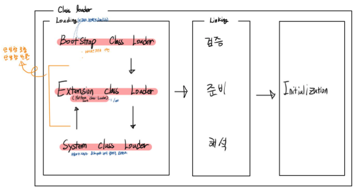

# JVM은 class 파일들을 어떻게 링킹할까?

위 그림은 자바의 링킹을 수행하는 JVM의 구조이다.

검증부터 해석까지 완료되어야 초기화가 진행된다.

### Verify(검증) : 바이트 코드가 변형되지 않고 유효한지 확인

클래스 로더가 .class파일의 정확성을 보장하기 위해 바이트코드인 .class 파일을 자바 언어 명세서에 따라 코드를 작성했는지, JVM 규격에 따라 검증된 컴파일러에서 .class 파일을 생성했는지 확인한다. 이를 바이트 코드 검증기가 처리

- 심볼 테이블이 일관되고 올바른 형식인지 검사
- 접근 지정자에 따른 접근 범위에서 메서드에 접근하고 있는지 검사
- 메서드의 매개변수 수와 자료형이 올바른지 검사
- final 메서드와 클래스가 오버라이드 되지는 않았는지 검사
- 변수를 읽기 전에 초기화 되었는지 검사
- 변수가 올바른 타임의 값인지 검사

### Prepare(준비) : 클래스 변수(static)와 기본값에 필요한 메모리를 할당 받음.

클래스가 필요로 하는 메모리를 할당, 클래스에 정의된 필드*메서드*인터페이스들을 나타내는 데이터 구조를 준비한다. 실제로 할당 값은 초기화 단계에서 할당된다. 준비단계에서는 우선 기본값으로 초기화 된다.

### Resolve(완료) : 심볼릭 레퍼런스를 실제 힙 메모리 주소로 재배치

책에서 이야기하는 N쪽의 N을 실제 페이지 넘버로 재배치하는 과정.

이렇게 세가지 단계로 나눠서 진행하는데 책에서 나오는 구조와 링킹 구조와 비슷하다.