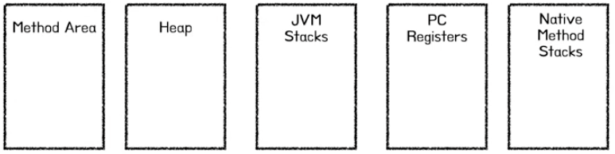
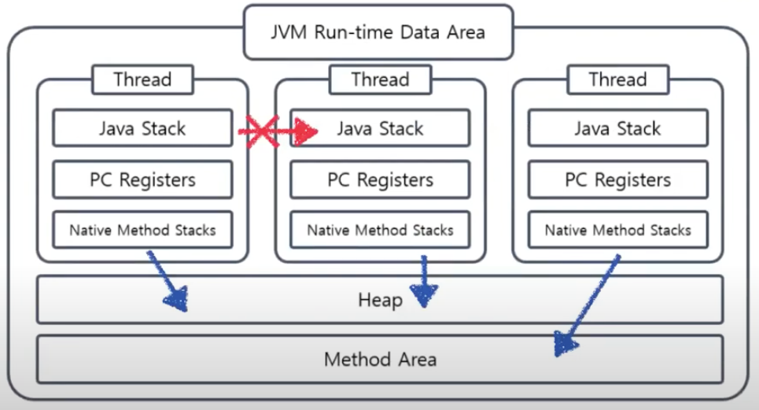

## Summary
- JVM Memory Layout 파헤쳐보기

<br>

## Concept
- Java Virtual Machine 의 메모리 구조는 크게 5가지 영역으로 구분
- Method Area, Heap, Stack, PC Register, Native Method Stack

<div style="text-align:center;">
  </img>
</div>

<br>

**Method Area**
- 실행 시점에 사용되는 Constant Pool, field, method, constructors 데이터 저장
- 실행 시점에 메모리 공간이 부족하면 OOM(OutOfMemoryError) 발생
- 스레드 공유 O


**Heap**
- 객체 및 인스턴스 변수, 배열 등과 같은 타입의 값들이 저장
- Ex) Example example = new Example();
- 가비지 컬렉션(GC) 발생하는 공간
- 스레드 공유 O


**Stack**
- 특정 메소드가 호출 되고 실행되면서 사용되는 지역 변수, 중간 연산 결과 값이 갱신되며 저장되는 영역
- 메소드 호출 시점마다 Stack Frame이라는 하나의 단위가 스택에 생성되고, 해당 메소드가 종료되는 시점에 파괴
- 스레드 공유 X


**PC Register**
- 현재 실행되고 있는 명령어의 주소 값이 저장되는 공간
- PC Register는 현재 실행하고 있는 명령어의 실행이 끝나면 다음 명령어의 주소 값을 갱신
- 스레드 공유 X

**Native Method Stack**
- Java가 아닌 C, C++과 같은 언어로 작성 된 메소드(Native Method) 실행을 지원하는 영역
- 스레드 공유 X

<br>

### JVM에서 스레드가 공유되는 메모리 영역(Heap, Method Area) 때문에 동기화 문제가 발생
<div style="text-align:center;">
  </img>
</div>

카운터 예시 코드

```java
public class Counter {
    private static int count = 0;

    public static synchronized void increment() {
        count++;
    }

    public static int getCount() {
        return count;
    }

    public static void main(String[] args) {
        // 스레드 1
        Thread thread1 = new Thread(new Runnable() {
            @Override
            public void run() {
                for (int i = 0; i < 1000; i++) {
                    Counter.increment();
                }
            }
        });

        // 스레드 2
        Thread thread2 = new Thread(new Runnable() {
            @Override
            public void run() {
                for (int i = 0; i < 1000; i++) {
                    Counter.increment();
                }
            }
        });

        // 스레드 시작
        thread1.start();
        thread2.start();

        // 스레드가 모두 종료될 때까지 대기
        thread1.join();
        thread2.join();

        // 결과 출력
        System.out.println(Counter.getCount());
    }
}
```

- 각 스레드는 1000번씩 호출하여 변수의 값은 2000이 나와야 하지만 나오지 않는다.
- 두 스레드가 동시에 count 값을 읽고, 1을 더한 값을 같은 시점에 쓰려고 하면, count가 두 번 증가한 것이 아니라 한 번만 증가할 수 있습니다.
- 멀티 스레드를 이용할 때 thread safe 하게 할려면 뮤텍스(Mutex)나 세마포어(Semaphore), 동기화된 자료구조 클래스로 통해 해결
- 뮤텍스(Mutex) 예시 코드
```java
// synchronized 메서드
public synchronized void increment() {
    count++;
}
```


