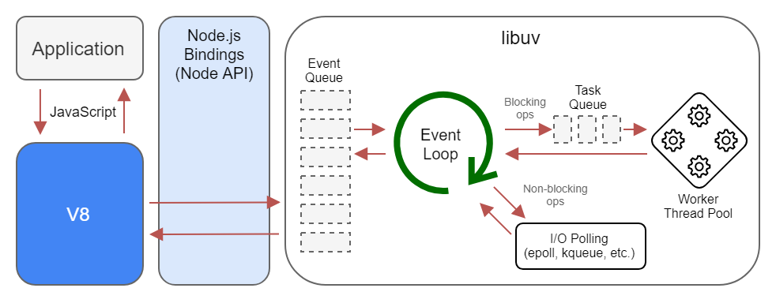

### What are Threads?

- 스레드는 프로세스 내에서 실행되는 가벼운 실행 단위. 스레드는 자신이 속한 프로세스의 동일한 메모리 공간과 리소스(예: CPU 시간)를 공유. 이를 통해 단일 프로세스 내의 여러 스레드가 동시에 명령을 실행하는 것처럼 보이게 하여 전반적인 효율성을 향상시킬 수 있음.

### Why use Threads?

- 스레드의 주요 목적은 단일 프로세스 내에서 병렬 처리를 가능하게 하는 것.-
- **I/O operations**
  - 파일에서 읽기, 네트워크를 통한 데이터 전송, 사용자 입력 대기 등이 모두 I/O 작업의 예. 한 스레드가 I/O 작업이 완료될 때까지 기다리는 동안 다른 스레드는 계속 실행할 수 있으므로 전체 프로세스가 중단되는 것을 방지할 수 있음.
- **Long calculations**
  - 프로세스에 긴 계산이 포함된 경우 다른 스레드는 계산이 완료될 때까지 기다리지 않고 별도의 작업을 계속할 수 있음.

### node.js 에서의 Threads?

- Node.js의 맥락에서 스레드는 차단되지 않는 I/O 작업을 처리하는 데 중요한 역할을 함. 디스크에서 파일을 읽거나 네트워크 소켓으로 데이터를 전송하는 등 Node.js 애플리케이션이 I/O 작업을 수행할 때, 해당 작업을 담당하는 스레드는 I/O가 완료될 때까지 기다리는 동안 일시적으로 차단될 수 있음. 그러나 동일한 프로세스 내의 다른 스레드는 계속 실행될 수 있으므로 애플리케이션이 응답성을 유지하고 멈추지 않음.

 

 
 

- 이벤트 루프는 콜백 및 I/O 작업의 실행을 관리하는 Node.js의 핵심 메커니즘.
- 아래와 같은 방식을 통해 Node.js는 메인 스레드를 차단하지 않고 비동기 I/O 작업을 관리할 수 있음.
  1. 이벤트 루프는 실행 대기 중인 콜백을 보관하는 이벤트 큐를 지속적으로 모니터링.
  2. I/O 작업이 완료되면 해당 콜백이 이벤트 큐에 배치.
  3. 이벤트 루프는 큐에서 콜백을 검색하고 실행하여 애플리케이션이 이벤트에 응답하고 I/O 작업을 효율적으로 처리하도록 함.
  4. 스레드는 이벤트 루프에 I/O 작업을 위임한 다음 완료될 때까지 기다리는 방식으로 이벤트 루프와 상호 작용.
  5. I/O 작업이 완료되면 해당 콜백에 알림이 전송되고 이벤트 루프가 실행을 처리.

### Node.js에서 스레드 사용의 이점

1. 성능 향상: 스레드를 사용하면 Node.js가 메인 스레드를 차단하지 않고도 I/O 작업을 효율적으로 처리할 수 있으므로 애플리케이션의 응답성과 성능이 향상
2. 효율적인 리소스 활용: 스레드를 사용하면 Node.js가 여러 CPU 코어를 효과적으로 활용하여 워크로드를 분산하고 전반적인 처리 속도를 향상시킬 수 있음
3. 확장성: Node.js 애플리케이션은 스레드를 통해 추가 CPU 코어를 활용하여 증가하는 워크로드를 처리하도록 확장할 수 있음

### 참고

- Node.js는 자바스크립트 연산을 처리하고 모든 I/O를 처리하는 단일 메인 이벤트 루프가 있기 때문에 싱글 스레드임. 그러나 Node.js는 적절하게 사용하면 멀티스레딩의 이점을 제공할 수 있는 추가 기능을 제공.
