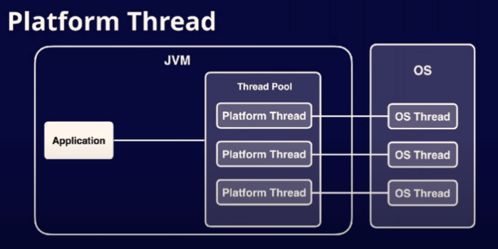
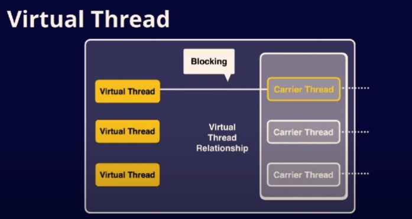
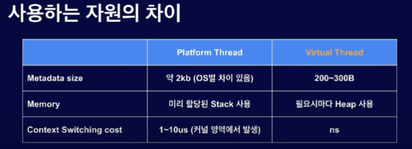

### Summary

- 코루틴을 이름만 알았지 아예 몰랐던 개념이라 조사했습니다.

코루틴은 제어문 중 하나라고 볼 수 있다.

### Concept

우선 코루틴이 뭘까요? 위키피디아에서는 아래와 같이 나와있어요.

- 첫째. **코루틴은 실행을 일시중단(suspend)하고 재개(resume)할 수 있도록 하여 비선점형 멀티태스킹(non-preemptive multitasking)을 위한 서브루틴을 일반화하는 컴퓨터 프로그램 구성 요소이다.**
- 둘째. 코루틴은 협력 작업(Cooperative task), 예외, 이벤트 루프, 반복자, 무한 목록 및 파이프와 같은 프로그램 구성 요소를 구현하는데 적합하다.

첫번째 부터 만만치는 않은데 우리가 읽고 있는 책에 내용을 보면 일시중단과 재개는 어느정도 알겠단 말이죠. 근데 비선점 멀티태스킹, 서브루틴 블라 블라는 전혀 모르겠어요. 무슨 말일까요?

### 비선점 멀티태스킹

비선점이 있으니깐 선점도 있겠죠?

뭘 선점하고 비선점하는거지? 여기서 대상은 한정된 자원을 말해요. 한정된 자원은 대표적으로 CPU가 있는데 이 선점과 비선점은 CPU를 말하는거 같네요. 결국 한정된 자원을 하나의 프로세스 또는 스레드만 독점하게되면 사용자는 여러 프로그램을 함께 실행시키지도 못하고 하나의 프로그램에서 여러 작업을 할 수가 없어요. 그래서 운영체제에서는 스케쥴링이라는걸 하는데 이 스케쥴링 방식의 두가지가 선점, 비선점 방식이 있는거에요.

- 비선점형 : 실행 주체가 자신의 실행권을 자발적으로 내려놓는 것, 하나의 프로세스가 CPU를 할당받으면 종료되기 전까지 다른 프로세스가 CPU를 강제로 차지할 수 없어요(코루틴)
- 선점형 : 실행 주체가 강제로 다른 실행주체의 실행권을 빼앗는 것, 하나의 프로세스가 다른 프로세스 대신에 프로세서(CPU)를 강제로 차지할 수 있는걸 말해요. (쓰레드)

(생각 : 여러 글들에서 쓰레드를 기반으로 스케쥴링을 설명하는데 프로세스도 동일하게 스케쥴링 대상이 되는데 왜 그렇게 국한되서 설명하는지 모르겠음.)

코루틴은 병행성은 제공하지만 병렬성은 제공하지 않아요. 병행성은 OS가 스케쥴링을 하는 방식과 같아요. 속임수 인거죠. 병렬성은 물리적으로 두개의 코어가 동작하는걸 말해요.

### 서브루틴

함수, 메서드, 프로시져와 같이 하나의 진입점을 가지고 있는 실행 흐름으로 볼 수 있어요. 메인 루틴은 main함수, 서브 루틴은 그 외 함수로 볼 수 있어요.

### 일시중단과 재개

코루틴은 실행 흐름을 중단하고 이후 개발자가 원하는 시기에 해당 실행흐름을 재개시킬 수 있어요. 이부분이 비선점형 스케쥴링 방식과 아주 유사해요. 개발자가 **원하는** 시점에 의도적으로 실행흐름을 중단하는 것과 실행 주체가 의도적으로 본인의 실행 주도권을 내려놓는 것.

결국 코루틴은 코드를 작성할 때 프로그램의 실행 흐름을 제어하기 위해 사용하는 조건문, 반복문, 예외처리문, 함수 등과 같이 Control flow 요소 중 하나라는 것을 알 수 있어요.

### 코루틴을 사용하면 어떤 이점이 있을까요?

이 코루틴을 각광 받게 만든게 코틀린이에요. 코루틴에 코가 코틀린이랑 같아서 코틀린에 특화된 방식이라고 생각할 수 있는데 위에서 말한대로 코루틴은 쓰레드보다 먼저 만들어진 개념이에요.

코틀린은 이 코루틴을 활용해서 멀티 쓰레딩에서 발생할 수 있는 동시성, 레이스 컨디션 등 다양한 문제들을 해결하면서 비동기 방식을 사용할 수 있게 만들었어요.

핵심은 구현도 간단하고 비동기 방식으로 사용할 수 있는데 여기에 더해 기존 멀티 쓰레딩에서 발생할 수 있는 위험 부담을 줄여줘서 사용하는 것 같아요.

### 자바는 코루틴 같은 경량 쓰레드가 없을까?

있어요. 기존에는 Reactive 프로그래밍으로 병렬성을 제공했는데 병렬성은 두개의 context가 나눠지기 때문에 코드 이해도가 높은 것과 함께 디버깅시 추적이 어려웠어요.

그래서 java 21버전에서는 virtual thread라는게 나왔어요. 이 virtual thread를 통해서 자바가 해결하려고 하는건 두가지에요.

1. 애플리케이션의 높은 처리량(throughput) → 이건 성능의 향상 타겟
    1. 처리량이 높아지는건 하나의 쓰레드가 블락킹 처리되는 과정이 아무리 많아도 JVM내부적으로 경량 스레드를 통해 거의 무한히 처리할 수 있음
2. 기존 스레드 구조를 해치지 않고 사용하는것  → 이건 개발 효율성 타겟

기존 구조

여기서 JVM은 OS의 스레드를 추상화해서 Platform Thread로 만들어서 사용해요. 이건 물리적인걸 그냥 논리적으로 바꿔서 사용할 분 논리적임을 충분히 활용하지 못하고 있어요.

어플리 케이션과 스레드 풀 사이에 Virtual thread라는 개념이 추가되요. 기존에 OS와 Platform thread가 1:1로 마운트 되었을 때는 Blocking이 발생하면 해당 스레드는 사용을 못했어요. 근데 virtual thread를 사용하면 1:1로 carrier thread(Platform thread)와 마운트 되어있다가 blocking되면 virtual thread는 돌아오고 carrier thread와 unmount 상태로 바뀌고 다른 virtual thread와 mount 되는거죠. 

책에서 본 것 처럼 JVT도 동일하게 Heap 영역에 task(JVT)의 작업들이 저장돼요.
