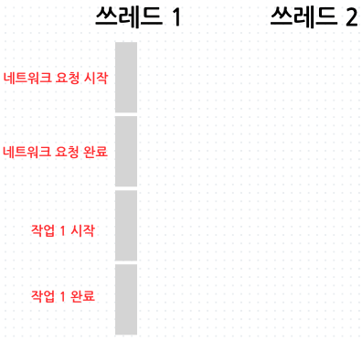
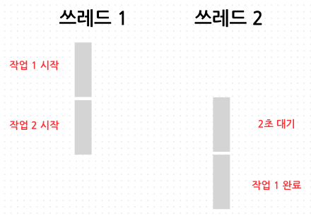
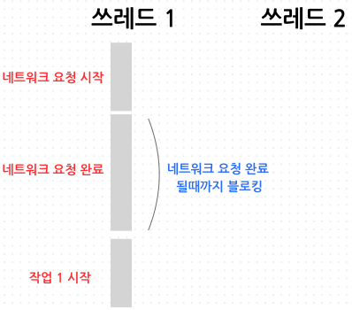
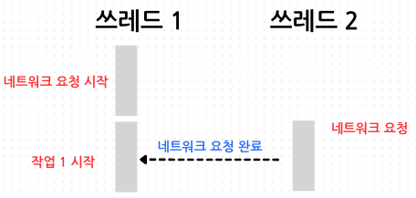
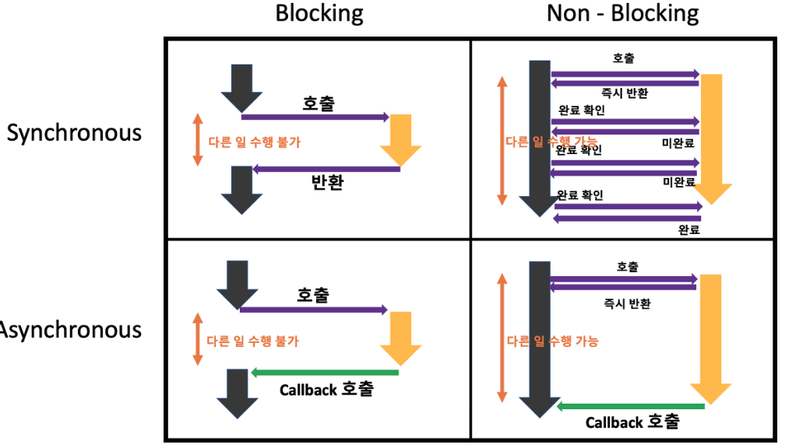

## Summary
동기, 비동기, 블로킹, 논블로킹의 차이점과 조합

<br>

## Concept
## 1. 동기, 비동기, 블로킹, 논블로킹 개념
### 동기
- 동기 작업은 하나의 작업이 완료될 때까지 다른 작업을 대기하는 방식입니다. 
- 즉, 현재 작업이 끝나야만 다음 작업이 시작됩니다. 작업이 순차적으로 실행되며, 작업 간에 의존성이 있는 경우에 주로 사용됩니다. 
- 데이터베이스 트랜잭션, 파일 읽기/쓰기 작업, 연속적인 계산 작업 등등에 사용합니다.
#### 예시 코드
```java
public class Example {
    public static void main(String[] args) {
        System.out.println("작업 1 시작");
        task1(); // 이 작업이 완료될 때까지 대기
        System.out.println("작업 2 시작");
    }

    public static void task1() {
        Thread.sleep(2000); // 2초 대기
        System.out.println("작업 1 완료");
    }
}
```
- 동기 작업은 순차적으로 처리되기 때문에 "작업 1 시작 -> 2초 대기 -> 작업 1 완료 -> 작업 2 시작" 흐름으로 처리됩니다.

#### 쓰레드 관점에서 보면
<div style="text-align:center;">
  </img>
</div>
- 쓰레드 1이 순차적으로 모든 작업을 수행한다.

<br>
<br>
<br>

### 비동기
- 비동기 작업은 하나의 작업이 완료되지 않아도 다른 작업을 동시에 진행할 수 있는 방식입니다. 
- 작업이 병렬적으로 실행되며, 시스템 자원을 효율적으로 사용하고 응답 시간을 단축할 수 있습니다. 네트워크 요청, 이벤트 기반 프로그래밍 등등 사용합니다.
#### 예시 코드
```java
public class Example {
    public static void main(String[] args) {
        System.out.println("작업 1 시작");
        CompletableFuture.runAsync(() -> task1()); // 비동기 작업
        System.out.println("작업 2 시작");
    }

    public static void task1() {
        Thread.sleep(2000); // 2초 대기
        System.out.println("작업 1 완료");
    }
}
```
- 비동기 작업은 대기하지 않고 다음 작업을 계속 진행하기 때문에 "작업 1 시작 -> 작업 2 시작 -> 2초 대기 -> 작업 1 완료" 흐름으로 진행합니다.

#### 쓰레드 관점에서 보면
<div style="text-align:center;">
  </img>
</div>

- 쓰레드 1이 "작업 1"을 시작하고 비동기 작업은 쓰레드 2에서 실행합니다.
- 쓰레드 1는 비동기 작업이 완료될 때까지 기다리지 않고 다음 작업인 "작업 2"를 시작합니다.
- 비동기 쓰레드 2는 백그라운드에서 2초 동안 대기한 후 "작업 1 완료"를 출력합니다.

<br>

### 블로킹
- 블로킹 작업은 작업이 완료될 때까지 제어권을 반환하지 않는 방식입니다. 호출한 작업이 끝날 때까지 호출한 쓰레드는 멈춥니다. 
- 작업이 완료될 때까지 다른 작업을 수행할 수 없으며, 리소스 낭비가 발생할 수 있습니다. 
- 간단하고 직관적인 구현이 가능하지만 성능이 저하될 수 있습니다. 파일 I/O, 소켓 I/O 등등 사용합니다.

#### 예시 코드
```java
public class Example {
    public static void main(String[] args) {
        System.out.println("네트워크 요청 시작");
        blockingTask(); // 블로킹 작업
        System.out.println("작업 1 시작");
    }

    public static void blockingTask() throws IOException {
        URL url = new URL("https://www.example.com");
        HttpURLConnection connection = (HttpURLConnection) url.openConnection();
        connection.connect();	// 외부 연결
        
        System.out.println("네트워크 요청 완료");
    }
}
```
- 블로킹은 네트워크 요청이 완료될 때까지 제어권이 반환되지 않으므로, "네트워크 요청 시작 -> 네트워크 요청 완료 -> 작업 1 시작" 흐름으로 진행합니다.


#### 쓰레드 관점에서 보면
<div style="text-align:center;">
  </img>
</div>

- 쓰레드 1에서 네트워크 요청을 보냅니다. 해당 작업이 완료가 될 때까지 쓰레드 1은 블로킹 상태에 있습니다.
- 응답을 받으면 작업 1을 시작합니다.


<br>

### 논블로킹
- 논블로킹 작업은 작업이 완료되지 않아도 제어권을 즉시 반환하는 방식입니다. 
- 호출한 작업이 완료되지 않아도 호출한 쓰레드는 멈추지 않고 다른 작업을 계속 진행합니다. 
- 작업을 요청한 후 바로 제어권을 반환하여 다른 작업을 수행할 수 있으며, 작업이 완료되면 별도의 콜백 함수나 이벤트를 통해 결과를 처리합니다. 
- 네트워크 서버, 이벤트 드리븐 시스템, 논블로킹 I/O, 멀티스레드 환경에서의 동시성 제어 등등 사용합니다.

#### 예시 코드
```java
public class Example {
    public static void main(String[] args) {
        System.out.println("네트워크 요청 시작");
        nonBlockingTask(); // 논블로킹 작업
        System.out.println("다른 작업 시작");
    }

    public static void nonBlockingTask() {
        HttpClient client = HttpClient.newHttpClient();
        HttpRequest request = HttpRequest.newBuilder()
                .uri(URI.create("https://www.example.com"))
                .build();

        CompletableFuture<HttpResponse<String>> response = client.sendAsync(request, BodyHandlers.ofString());
        response.thenAccept(res -> {
            System.out.println(res.body());
            System.out.println("네트워크 요청 완료");
        });
    }
}
```
- 네트워크 요청이 비동기로 실행되므로, 메인 스레드는 대기하지 않고 다음 작업을 계속 진행합니다. 
- 네트워크 요청이 완료되면 콜백 메서드가 실행됩니다. 실행 흐름은 "네트워크 요청 시작 -> 작업 1 시작 -> 네트워크 요청 완료" 실행합니다.


#### 쓰레드 관점에서 보면
<div style="text-align:center;">
  </img>
</div>

- 쓰레드 1에서 "네트워크 요청 시작" 출력합니다.
- nonBlockingTask 메서드를 호출하여 비동기로 쓰레드 2에서 네트워크 요청을 보냅니다.
- 쓰레드 1은 네트워크 요청이 완료될 때까지 기다리지 않고 즉시 다음 명령으로 이동하여 "작업 1 시작"을 출력합니다.
- 비동기 쓰레드 2는 백그라운드에서 네트워크 요청을 처리하고, 요청이 완료되면 콜백 메서드(thenAccept)를 실행하여 응답을 출력합니다.

<br >
<br >

## 2. 동기, 비동기, 블로킹, 논블로킹 차이점
### [ 동기  vs 비동기 ]
- 동기: 작업이 순차적으로 실행되며, 하나의 작업이 완료될 때까지 다음 작업을 대기
- 비동기: 작업이 병렬적으로 실행되며, 작업이 완료되지 않아도 다른 작업을 동시에 진행


### [ 동기  vs 블로킹 ]
- 동기 호출은 반드시 블로킹이 아닌 반면에 블로킹 호출은 모두 동기 호출입니다.
- 동기: 어떤 함수를 동기 호출했다고 해서 블로킹되거나 스레드가 일시 중지되지 않는다.
- 블로킹, 동기: 어떤 함수를 동기 호출했다고 해서 블로킹되거나 스레드가 일시 중지된다.


### [ 동기  vs 논블로킹 ]
- 동기적 요청 중 논블로킹 방식으로 데이터를 조회하거나 처리할 때 사용

### [ 비동기  vs 블로킹 ]
- 이 조합은 일반적으로 사용되지 않으며, 비동기 작업의 본질과 맞지 않음


### [ 비동기  vs 논블로킹 ]
- 비동기, 논블로킹: 네트워크 요청을 보내고 다른 작업하기
- 비동기, 논블로킹: 네트워크 요청을 보내고 특정 주기(10초, 1분, 5분) 확인하면서 다른 작업하기
- 논블로킹: 네트워크 요청을 보내고 다른 작업을 할 수 있는데 하지 않고 네트워크 응답이 왔는지만 확인하기


### [ 블로킹 vs 논블로킹 ]
- 블로킹: 작업이 완료될 때까지 제어권을 반환하지 않으며, 호출한 쓰레드는 멈춤
- 논블로킹: 작업이 완료되지 않아도 제어권을 즉시 반환하며, 호출한 쓰레드는 멈추지 않음

<br>
<br>

## 3. 동기, 비동기, 블로킹, 논블로킹 조합
<div style="text-align:center;">
  </img>
</div>


### [ 동기 + 블로킹 ]
- 동기 + 블로킹 조합은 다른 작업이 진행되는 동안 자신의 작업을 처리하지 않고 (Blocking), 다른 작업의 완료 여부를 바로 받아 순차적으로 처리하는 (Sync) 방식이다. 
- 다른 작업의 결과가 자신의 작업에 영향을 주는 경우에 활용할 수 있다. 
- 예를 들어 파일을 읽는 함수가 호출되면, 파일을 모두 읽을 때까지 호출한 프로그램은 아무 작업도 하지 않고 기다립니다.
- 하지만 작업이 완료될 때까지 다른 작업을 할 수 없어 비효율적일 수 있습니다.


### [ 동기 + 논블로킹 ]
- 동기 + 논블로킹 조합은 다른 작업이 진행되는 동안에도 자신의 작업을 처리하고 (Non Blocking), 다른 작업의 결과를 바로 처리하지 않아 작업 순서가 지켜지지 않는 (Async) 방식이다. 
- 다른 작업의 결과가 자신의 작업에 영향을 주지 않은 경우에 활용할 수 있다. 
- 예를 들어 파일을 읽는 함수가 호출되면, 파일을 바로 읽기 시작하지만 호출자는 주기적으로 파일 읽기가 완료되었는지 확인해야 합니다. 
- 하지만 주기적으로 상태를 확인해야 하므로 여전히 비효율적일 수 있습니다.


### [ 비동기 + 블로킹 ]
- 비동기 + 블로킹 조합은 다른 작업이 진행되는 동안 자신의 작업을 멈추고 기다리는 (Blocking), 다른 작업의 결과를 바로 처리하지 않아 순서대로 작업을 수행하지 않는 (Async) 방식이다. 
- Async-blocking의 경우는 실무에서 잘 마주하기 쉽지 않아 다룰일이 거의 없다.


### [ 비동기 + 논블로킹 ]
- 비동기 + 논블로킹 조합은 다른 작업이 진행되는 동안에도 자신의 작업을 처리하고 (Non Blocking), 다른 작업의 결과를 바로 처리하지 않아 작업 순서가 지켜지지 않는 (Async) 방식이다. 
- 다른 작업의 결과가 자신의 작업에 영향을 주지 않은 경우에 활용할 수 있다. 
