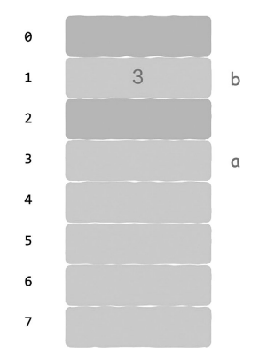

# Summary
포인터와 참조

# Concept
메모리의 가장 작은 단위는 `메모리 셀` : 0과 1만 보관 가능하다.   
우리는 이것을 여러 종류의 정보를 저장하는데 사용한다.   
가령 **1bit**는 (참/거짓) 을 나타낼 수 있고   
**1byte**(8bit)는 문자 하나를 나타낼 수 있다.   
**4byte**는 정수 하나를 표현할 수 있고 (이는 CPU 시스템에 따라 다르다)   
**nbyte**로 여러 정보를 조합한 구조체(객체)를 나타내기도 한다.

어셈블리어 단계에서는 아래와 같이 메모리 주소를 직접 지정해줄 수 있다.
``` c++
// (메모리 주소와 값의 구분이 모호하므로, 값에는 앞에 $를 붙여서 구분)
store $1 6 // 6번 메모리에 1이란 값을 저장해라
```
하지만 사람들이 사용하기에는 메모리 주소 6은 생소하다.
그래서 아래와 같이 메모리 주소에 'a'라는 이름을 붙이고 거기에 1이라는 값을 저장하도록 표현한다. 
```c++
int a = 1;
```
여기엔 중요한 정보가 감춰져 있다.   
**그 정보는 바로 a 변수가 나타내는 숫자 1이 메모리 주소 6에 저장되어 있다는 것입니다.**   
즉 a에는 2가지 의미가 있다.
1. 값 1을 나타냅니다.
2. 이 값은 메모리 주소 6에 저장됩니다.

## 포인터
**포인터는 메모리 주소를 더 높은 수준으로 추상화한 것**   
**이 추상화 목적은 간접 주소 지정을 감싸기 위한 것**


### 직접 주소 지정 방식
주소를 따라가면 값이 있음 (1번 접근)
``` c++
load r1 3   // 3번 메모리에 있는 값을 레지스터1에 적재해라
```
### 간접 주소 지정 방식
주소를 따라가면 `값이 저장된 주소`가 있음 (2번 접근)
``` c++
load r1 @1  // 1번 메모리에 있는 값을 `주소`로 해석해라
            // 1번 메모리에는 3이라는 값이 있는데, 이것을 주소로 해석해서
            // 최종적으로 3번 메모리에 있는 값을 레지스터1에 적재해라 가 된다.
```


## 참조
`북위 37.5519°, 동경 126.9918°에 있는 그 사람` : 주소적 접근 (포인터)   
`윤태진, 태진아, 태진님, 태진씨` : 다른 이름 같은 사람 (참조)

* 참조와 포인터의 공통점 :   
    참조를 사용하면 데이터를 복사할 필요가 없기 때문에 포인터를 사용할 때와 동일한 효과를 얻을 수 있습니다.
* 참조와 포인터의 차이점 :   
    참조는 포인터와 유사한 구조의 산술 연산을 할 수 없다. 메모리 위치에 값을 더하거나 빼면 각각의 메모리 주소에 저장되어 있는 데이터를  볼 수 있지만, 참조에는 이런 기능이 없기 때문에 ‘태진’이라는 이 참조에 1을 더하거나 1을 빼는 것은 아무런 의미가 없다.


> 포인터는 메모리 주소를 추상화한 것이고 참조는 포인
터를 한 번 더 추상화한 것이라고 할 수 있습니다.


# Advantages
포인터 개념이 있으면 프로그래머는 메모리 같은 하드웨어를 직접 조작할 수 있다.
## 포인터가 있어야만 할 수 있는 작업들
1. 동적 메모리 할당 및 관리
    ```c++
    int *ptr = new int[10]; // 동적 배열 할당
    delete[] ptr; // 할당된 메모리 해제
    ```
2. 메모리 매핑 및 하드웨어 제어:
저수준 시스템 프로그래밍에서는 포인터를 사용하여 특정 메모리 주소에 직접 접근하거나 하드웨어를 제어합니다.
    ```c++
    #define PERIPHERAL_ADDR 0x40000000
    int *peripheral = (int *)PERIPHERAL_ADDR;
    *peripheral = 0xFF; // 특정 하드웨어 레지스터에 값 쓰기
    ``` 
3. 저수준 메모리 제어 및 최적화:
특정한 메모리 주소에 직접 접근하거나 저수준에서 메모리를 관리해야 하는 경우, 포인터가 필요합니다. 이는 주로 시스템 프로그래밍, 드라이버 개발, 임베디드 시스템에서 중요합니다.

4. 성능 최적화:
직접 메모리 접근을 통해 성능을 최적화해야 할 때, 포인터가 유용합니다. 예를 들어, 메모리 복사, 버퍼 처리, 대용량 데이터 처리 시 포인터를 사용하면 성능을 높일 수 있습니다.


# Disadvantages
포인터 연산에 오류가 있을 때는 프로그램 실행 상태를 직접 파괴해 버릴 수 있다는 것 (요즘은 막아주는 장치가 있어서 매우 확률이 낮음)
1. 메모리 누수 (Memory Leak):   
동적으로 할당된 메모리를 해제하지 않으면 메모리 누수가 발생합니다. 이는 프로그램이 실행되는 동안 사용 가능한 메모리가 점점 줄어들게 만듭니다.
    ```c++
    int *ptr = (int *)malloc(sizeof(int) * 10);
    // free(ptr);  // 메모리 해제를 잊음 -> 40바이트 손실
    ```
2. 널 포인터 참조 (Null Pointer Dereference):   
초기화되지 않은 포인터 또는 널 포인터를 역참조하면 프로그램이 충돌할 수 있습니다.
    ```c++
    int *ptr = NULL;
    *ptr = 10;  // 널 포인터를 역참조하여 충돌 발생
    ```
    > 오류를 알리지 않고, 예기치 않은 결과를 초래함
3. 뎅글링 포인터 (Dangling Pointer):   
이미 해제된 메모리를 참조하는 포인터를 뎅글링 포인터라고 합니다. 뎅글링 포인터를 사용하면 예기치 않은 동작이나 충돌이 발생할 수 있습니다.   
    ```c++
    int *ptr = (int *)malloc(sizeof(int));
    free(ptr);
    *ptr = 10;  // 해제된 메모리를 참조하여 충돌 발생
    ```
    > 오류를 알리지 않고, 예기치 않은 결과를 초래함
4. 버퍼 오버플로 (Buffer Overflow):   
포인터를 사용하여 배열을 잘못 처리하면 버퍼 오버플로가 발생할 수 있습니다. 이는 메모리 손상, 데이터 손실 또는 보안 취약점을 초래할 수 있습니다.
    ``` c++
    char buffer[10];
    strcpy(buffer, "This is a very long string");  // 버퍼 오버플로 발생
    ```
    > error C4996: 'strcpy': This function or variable may be unsafe. Consider using strcpy_s instead. To disable deprecation, use _CRT_SECURE_NO_WARNINGS. See online help for details.

    
5. 안전하지 않은 타입 캐스팅:   
포인터 타입을 잘못 캐스팅하면 데이터 손상이나 예기치 않은 동작이 발생할 수 있습니다.
    ```c++
    float f = 3.14;
    int *ptr = (int *)&f;
    printf("%d", *ptr);  // 잘못된 타입 캐스팅
    ```
    > 출력 값 : 1078523331
6. 메모리 접근 오류:   
유효하지 않은 메모리 주소를 참조하면 메모리 접근 오류가 발생합니다. 이는 프로그램이 예기치 않게 종료될 수 있습니다.
    ```c++
    int *ptr = (int *)0x12345678;  // 임의의 메모리 주소
    *ptr = 10;  // 메모리 접근 오류
    ```
    > 오류를 알리지 않고, 예기치 않은 결과를 초래함
7. 포인터 초기화 문제:   
포인터를 초기화하지 않고 사용하면 예측할 수 없는 결과가 발생할 수 있습니다. 초기화되지 않은 포인터는 임의의 메모리 주소를 가리킬 수 있습니다.
    ```c++
    int *ptr;
    *ptr = 10;  // 초기화되지 않은 포인터 사용
    ```
    > error C4700: uninitialized local variable 'ptr' used

# Wrap-up
포인터는 `잘 쓰면` 메모리와 하드웨어에 직접 접근을 가능하게 해줘서, 유연한 프로그래밍이 가능하고 성능 면에서 뛰어나다.   
하지만 `잘못 쓰면` 언제 터질지 모르는 폭탄이 된다.