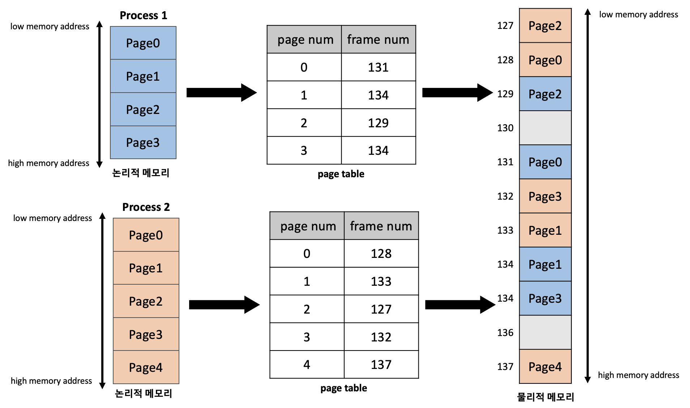

# page table : 가상 메모리와 물리 메모리 사이의 mapping 관계를 기록하는 레코드

### 사전 지식 및 용어정리

가상 메모리 공간은 4GB(32bit시스템 기준)짜리 배열과 같다.

char[43억] 짜리 배열 안에서 heap, stack 등 다양한 논리적 메모리 구조로 나눈다.

가상 메모리는 절대적 기준을 가지고 있다. 이 절대적 기준은 프로세스의 시작 주소를 말한다.

가상 메모리상의 시작 주소는 모든 프로세스마다 동일한 주소를 가진다.

이 동일한 주소를 기준으로 특정 데이터의 상대적 거리를 표현할 수 있는데 이 거리를 distance 또는 offset이라고 한다.

<aside>
💡 결국 4GB의 프로세스를 4KB 단위인 페이지로 자르고 index가 0인 페이지가 기준점이고 어던 데이터를 찾거나 논리적 구조로 나눌 때는 페이지 index 기준으로 자른다. 그리고 데이터를 찾을 때는 페이지 index 기준으로 offset이 몇번째에 있는지를 확인해서 찾는다.

</aside>

|————|————-| ….. |—————|

0           1               2      200         201

각 숫자는 페이지 인덱스를 나타낸다. 특정 데이터는 [0,20]이렇게 이중 배열의 형태로 찾을 수 있다.

🍎  **용어정리**

- **논리적 주소(logical address)** : process가 memory에 적재되기 위한 독자적인 주소 공간인 논리적 주소(logical address)가 생성됩니다. 논리적 주소는 각 process마다 독립적으로 할당되며, 0번지부터 시작됩니다.
- **물리적 주소(physical address)** :  process가 실제로 메모리에 적재되는 위치를 말합니다.
- **주소 바인딩(address binding)** : CPU가 기계어 명령을 수행하기 위해 process**의 논리적 주소가 실제 물리적 메모리의 어느 위치에 매핑되는지 확인하는 과정**을 주소 바인딩(address binding)이라고 합니다.
- **페이지** : 가상 메모리를 일정한 크기로 나눈 블록, 윈도우 운영체제 기준 4KB(기본값, 수정 가능)
- **프레임(세그먼트)** : 물리 메모리를 일정한 크기로 나눈 블록, 특별한 이유가 없다면 페이지와 프레임(세그먼트)를 같은 크기로 맞춘다.
- **오프셋(offset, distance)** : 특정 기준으로부터 떨어진 상대적 거리를 말한다. 가령 배열의 첫번째 요소의 offset은 0이다. 두번째 요소의 offset은 1이다.

### 페이징 기법이란?

paging 기법은 process의 메모리 공간을 동일한 크기의 page 단위로 나누어 물리적 메모리의 서로 다른 위치에 page들을 저장하는 **메모리 관리 기법**을 말한다. paging 기법에서는 물리적 메모리를 **page와 같은 크기의 frame**으로 미리 나누어둔다.

paging 기법에서는 주소 바인딩(address binding)을 위해 모든 프로세스가 각각의 주소 변환을 위한 page table을 갖는다.

특정 크기로 나눈 페이지의 데이터를 찾을 때는

[페이지{번호},offest] → [프레임{번호}, offset] 으로 바뀐다.

요 사이에서 중요한 역할을 하는게 프로세스마다 하나씩만 존재하는 페이지 테이블이다.

페이지 테이블에는 가상 메모리의 페이지와 물리메모리의 프레임을 매핑한 테이블이다.

C언어를 사용하다보면 page fault라는 에러를 맞이할 수 있다. 여기서 page fault는 잘못된 페이지입니다 라고 해석할 수 있지만 사실, 페이지(가상 메모리에)에 매핑된 프레임(물리 메모리)이 없다라고 이해해야한다.

### 페이지 단편화**(Memory fragmentation)**

이 챕터를 읽다보면 내부 단편화라는 내용과 부딪히게된다. 이 내부 단편화는 메모리 크기를 정확히 예상할 수 없으니 발생할 수 있는 메모리 관리의 단점 중 하나이다. 사실상 malloc에서도 brk나 mmap 시스템 콜을 통해 내부 단편화가 발생하지 않도록 방지하지만 내용을 알고 있으면 좋을 것 같다.

🍎 **페이지 단편화란**

물리적 메모리 공간이 작은 조각으로 나눠져서 메모리가 충분히 존재함에도 할당이 불가능한 상태를 보고 메모리 단편화가 발생했다고 말한다.

paging 기법에서는 process의 논리적 주소 공간과 물리적 메모리가 같은 크기의 page 단위로 나누어지기 때문에 외부 단편화 문제가 발생하지 않는다. 하지만 process 주소 공간의 크기가 page 크기의 배수라는 보장이 없기 때문에, 프로세스의 주소 공간 중 가장 마지막에 위치한 page에서는 내부 단편화 문제가 발생할 가능성이 있다.