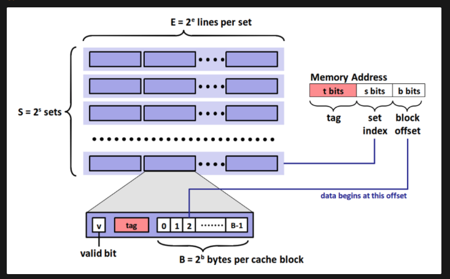

## Concept

### 🚀 캐시의 가장 중요한 개념은 데이터의 지역성

데이터의 지역성 세가지로

- 시간 지역성 : 한번 참조된 데이터는 다시 참조될 가능성이 높다.
- 공간 지역성 : 참조된 데이터와 연속되는 데이터들 또는 주변 데이터들은 참조될 가능성이 높다는 말입니다.
- 순차적 지역성 : 비순차적 실행이 아닌 이상 명령어들이 메모리에 저장된 순서대로 실행되는 특성을 고려하여 다음 순서의 데이터가 곧 사용될 가능성이 높다는 것입니다.

### 🚀 캐시 데이터 메모리 구조

- 캐시는 S개의 캐시라인 세트와 각 세트별 E개의 캐시 라인으로 구성
- 하나의 캐시 라인은 valid bit, tag, cache block으로 구성
    - valid bit : 이 캐시라인의 캐시 데이터가 유효한지
    - tag : 캐시라인을 구별할 수 있는 표시
    - cache block : 캐시 라인이 가진 실제 데이터
- 집합 연관 매핑
    - 메인 메모리의 특정 블록은 캐시의 특정 집합(하나의 캐시라인 세트)에만 매핑될 수 있다.
    - 하지만 하나의 캐시라인 세트에서라면 어떤 캐시라인에 저장되던 상관 없다.
    - 사용 이유 : 메모리 주소 참조 요청을 전달 받을 때, 즉 캐시 히트가 안되서 메모리 주소에서 데이터를 찾아와야할 때 캐시 메모리 내의 캐시라인들을 뒤져야한다. 따라서 특정 메모리 주소에 따라 각 캐시라인들을 매핑해서 Cache miss시에 데이터를 빠르게 가져오게 해준다.

### 🚀 **캐시의 읽기 방식**

- CPU는 캐시에 메모리 참조 주소를 요청한다.
- 메모리 주소는 위에 그림에서 확인할 수 있다.
- S bit를 이용해 캐시 메모리의 몇번재 캐시라인세트에 있는지 확인하고
- t bit을 활용해서 캐시 라인 공간 조회
- valid bit의 유효성을 체크하고 데이터를 가져온다.
- 없으면 이방식으로 2차, 3차 캐시를 조회한다.
- 여기서 찾으면 Cache hit, 못찾으면 Cache Miss라고 이야기한다.
- 데이트를 찾아와야하지만 캐시가 가득차있다면 **교환 정책**이 실행된다.

### 🚀 **캐시의 쓰기 방식**

CPU가 데이터를 쓰는 작업을 할 때, 캐시 메모리와 주 메모리의 일관성을 유지하는 것이 중요하다. 이를 위해 두 가지 주요 쓰기 정책이 사용됩니다: Write-through와 Write-back입니다.

1. **Write-through (동시 쓰기)**
Write-through 방식은 CPU가 데이터를 쓸 때 캐시와 주 메모리에 동시에 쓰는 방식입니다.
    - 작동 방식:
        1. CPU가 데이터를 쓰려고 할 때, 먼저 캐시를 확인합니다.
        2. 해당 데이터가 캐시에 있다면 (Cache Hit), 캐시의 데이터를 업데이트합니다.
        3. 동시에 주 메모리의 해당 주소에도 같은 데이터를 씁니다.
        4. 만약 데이터가 캐시에 없다면 (Cache Miss), 주 메모리에만 데이터를 씁니다.
    - 장점:
        - 캐시와 주 메모리의 일관성이 항상 유지됩니다.
        - 시스템 장애 시 데이터 손실이 최소화됩니다.
    - 단점:
        - 모든 쓰기 작업이 주 메모리에 접근해야 하므로, 쓰기 작업의 속도가 상대적으로 느립니다.
        - 불필요한 쓰기 작업으로 인해 버스 트래픽이 증가할 수 있습니다.
2. **Write-back (후기입)**
Write-back 방식은 CPU가 데이터를 쓸 때 먼저 캐시에만 쓰고, 나중에 필요할 때 주 메모리에 쓰는 방식입니다.
    - 작동 방식:
        1. CPU가 데이터를 쓰려고 할 때, 먼저 캐시를 확인합니다.
        2. 해당 데이터가 캐시에 있다면 (Cache Hit), 캐시의 데이터만 업데이트합니다.
        3. 이때 해당 캐시 라인을 '더티(dirty)'로 표시합니다.
        4. 더티 상태의 캐시 라인이 교체되어야 할 때, 또는 특정 조건에 도달했을 때 주 메모리에 쓰기 작업을 수행합니다.
        5. 만약 데이터가 캐시에 없다면 (Cache Miss), 해당 블록을 캐시로 가져온 후 캐시에 쓰기를 수행합니다.
    - 장점:
        - 쓰기 작업이 주로 캐시에서 이루어지므로 속도가 빠릅니다.
        - 여러 번의 쓰기 작업을 한 번에 처리할 수 있어 버스 트래픽을 줄일 수 있습니다.
    - 단점:
        - 캐시와 주 메모리의 일관성 유지가 복잡해집니다.
        - 시스템 장애 시 캐시에만 존재하던 데이터가 손실될 수 있습니다.

### Wrap-up

이정도 개념을 알고 있으면 Global Caching 전략도 충분히 대응이 가능할 것 같다. 

이번 개념을 정리하면서 캐싱전략이 다향하지만 큰 꼭지는 두가지라는걸 알 수 있었다.